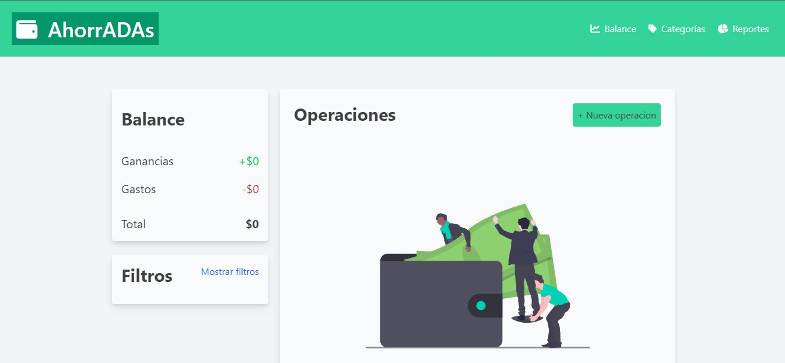
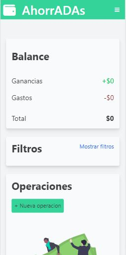
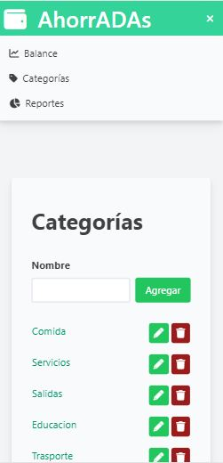

## AhorrADAs

### AhorrADAs es una aplicación web que te permite llevar un registro de tus gastos e ingresos de manera sencilla y eficiente.

#### Para visualizar la página [click aqui](https://eveolmedo.github.io/Generador-de-memes/)

#### Funcionalidades
- ##### Agregar, editar y eliminar operaciones
- ##### Agregar, editar y eliminar categorías
- ##### Se pueden filtrar tus operaciones según distintos criterios, como tipo, categoría, fecha y orden alfabético. Esto te permite visualizar y analizar tus registros de manera más específica.
- ##### Se puedem obtener reportes detallados por mes y por categoría a partir de tus operaciones registradas. Estos reportes te ayudarán a tener una visión clara de tus gastos e ingresos en diferentes períodos y categorías.
- ##### Almacenamiento local: Los datos que ingreses en AhorrADAs se guardarán en el navegador, lo que te permite acceder a ellos sin perder tu información.

##### Cuenta con una interfaz responsiva, lo que significa que podrás acceder y utilizar la aplicación tanto en computadoras de escritorio como en tablets y celulares.

 
